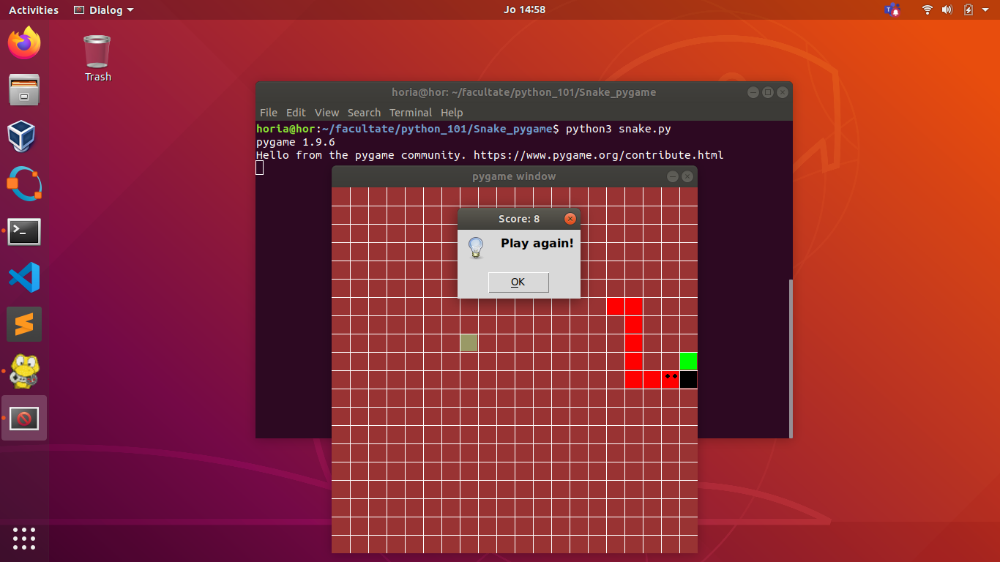

# Snake_pygame
sudo apt-get install python3-tk
# Installation

Before you run the game, you need to be sure you have installed Python3 and 
Pygame. In case you haven't, here are some simple instructions to follow:

    1. Install Python3: sudo apt-get install python3
    2. Install Pygame: sudo apt-get install python-pygame
    3. Install tkinter module: sudo apt-get install python3-tk

# Running the program(on Ubuntu/Linux)

    There are few steps left before your journey begins. Make sure to follow
    the next steps:

    1.Clone the repo: git clone https://github.com/sebapitur/Snake_pygame
    2.Go to the directory you cloned the repo (in your terminal)
    3.Use the command in terminal: python3 snake.py

# How to test your Snake skills - instructions

	Just enjoy our game using the arrows, and feel free to press the 
	'Play again' button as many times as you want.
    

# Creators
	
	Ignat Andrei-Horia and Pitur Sebastian

# Contribution

	We appreciate any contribution to this project regarding the bugs you may find.
